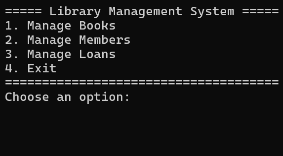
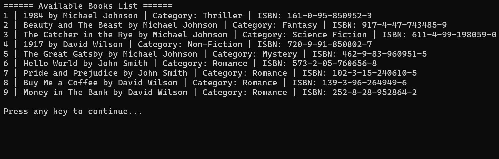
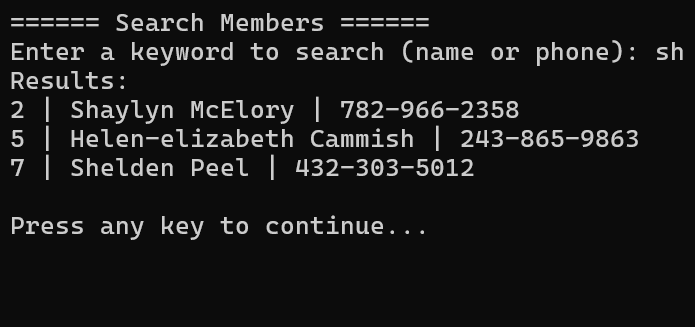

# Library Management Console App

A simple, extensible console-based library management system built using C#, OOP, and SOLID principles.
It demonstrates working with abstractions, layered architecture, JSON persistence, and clean console UI.

## Features
### Books
- Add new books
- List all books or only available books
- Search books by title, author, category, or ISBN
- Remove books

### Members
- Register new members
- List all registered members
- Search members by name or member ID

### Loans
- Borrow a book
- Return a book
- View all active loans and loan history

### Data Persistence
- All data (books, members, loans) is stored in JSON files
- Fully offline — no database required

## Prerequisites
- .NET 10 SDK
- __Visual Studio 2026__ or any editor that supports .NET 10
- Git

## Project Structure
```text
LibraryManagement/
│
├── Entities/
│   ├── Book.cs
│   ├── Member.cs
│   └── Loan.cs
│
├── Services/
│   ├── IBookService.cs
│   ├── BookService.cs
│   ├── IMemberService.cs
│   ├── MemberService.cs
│   ├── ILoanService.cs
│   └── LoanService.cs
│
├── Data/
│   ├── IDataStore.cs
│   └── DataStore.cs
│
├── UI/
│   └── Menu.cs
│
└── Program.cs
```

## Getting Started
1. Clone the repository: `git clone https://github.com/AhmedMohamedGab/Library-Management-Console-App.git`
2. Open the solution in __Visual Studio 2026__ using __File > Open > Project/Solution__ or use the CLI: `dotnet restore dotnet build dotnet run --project src/LibraryManagement`

## Screenshots
- Main Menu Screenshot

- Books Menu Screenshot

- Search Members Results Screenshot


## License
This project is licensed under the MIT license.

## Contributing
Contributions are welcome! Please fork the repository and create a pull request.
